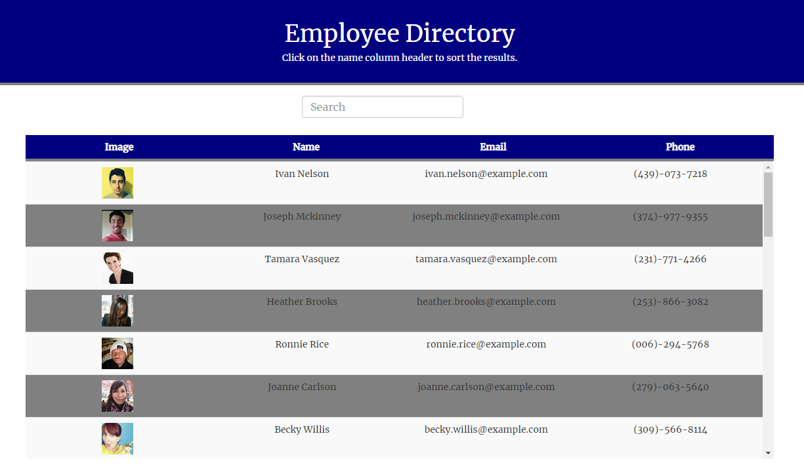

# React Employee Directory

Searchable and sortable employee directory created using React and the Random User Generator API.

## Description

---

The Employee Directory loads a sortable table with random users and displays a thumbnail picture, their name, email, and phone number.

## Installation

---

In order to use the employee director:

1. Navigate to the link provided below.
2. Enjoy!

## Usage

---

This program can be used with permission to generate a list of random users that includes their image, name, email, and phone number.

## License

---

## Contact

---

If you have any questions, please contact me at:\
✉️[Email](mailto:hrkoren@gmail.com)\
📂[GitHub](https://github.com/hrkoren)
